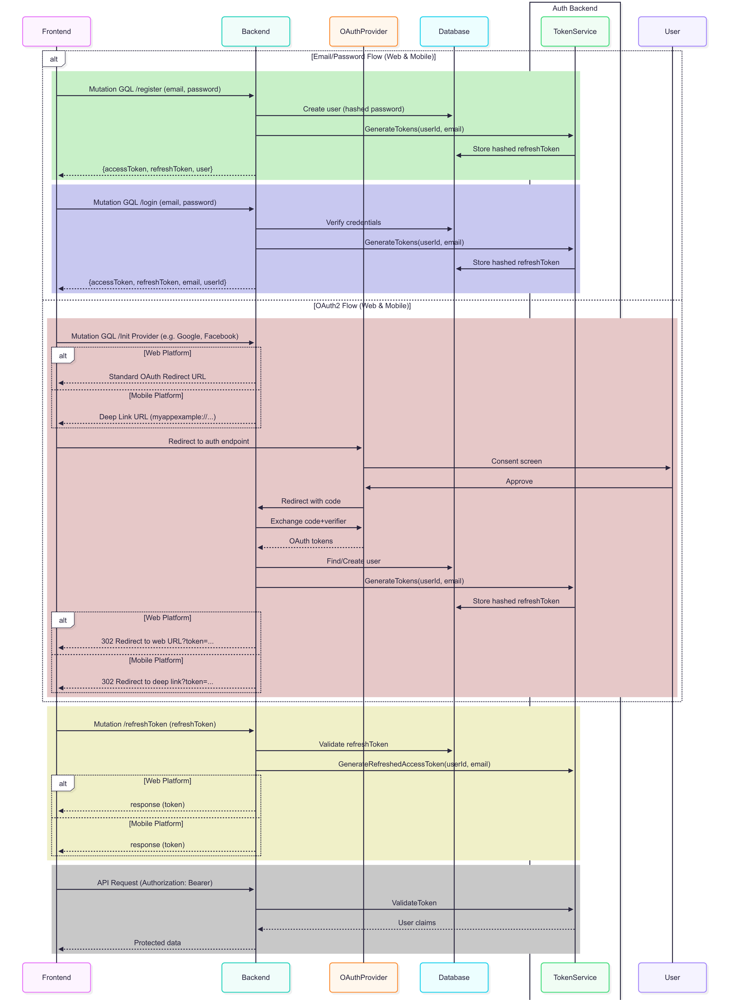

# Go Microservice (Authentication)

This is a Golang Authentication Microservice using GraphQL, Ent (ORM), Fiber (HTTP Router)

## Getting Started

#### Understanding the Authentication Service

This service is responsible for user authentication, including registration, login, and token management. It uses GraphQL for API interactions and Ent as the ORM for database operations.

[](./assets/auth-flow.png)

## 🚀 Microservice Session Management

This authentication service provides a complete solution for managing sessions across distributed microservices with **zero read/write overhead** on the auth service following industry best practices from Amazon, Netflix, Spotify, and Google.

### Key Features

- ✅ **Stateless JWT Authentication** - No session affinity required
- ✅ **Zero-Dependency Validation** - Microservices validate tokens independently
- ✅ **Real-time Token Invalidation** - Redis pub/sub for instant logout propagation
- ✅ **Horizontal Scalability** - Load balancer friendly, scales effortlessly
- ✅ **Distributed Blacklist** - Redis-based token blacklisting across all services
- ✅ **Local Cache** - In-memory blacklist cache for < 1ms validation
- ✅ **Graceful Degradation** - Works even if Redis is temporarily unavailable

### Quick Links

- 📖 [Microservice Session Management Guide](./docs/MICROSERVICE_SESSION_MANAGEMENT.md)
- 🏗️ [Deployment Architecture](./docs/DEPLOYMENT_ARCHITECTURE.md)
- 📦 [Session Validation Package](./pkg/session/README.md)
- 💡 [Example Microservice](./examples/example-microservice/README.md)

### How It Works

1. **Authentication Service** issues JWT tokens on login
2. **Microservices** validate JWT tokens locally (no auth service calls)
3. **Redis Pub/Sub** propagates token invalidation events instantly
4. **Local Cache** stores blacklisted tokens for ultra-fast validation

### Integration Guide

```go
import "github.com/abisalde/authentication-service/pkg/session"

// Initialize validator in your microservice
validator, _ := session.NewSessionValidator(session.Config{
    JWTSecret:     os.Getenv("JWT_SECRET"),
    RedisAddr:     os.Getenv("REDIS_ADDR"),
    RedisPassword: os.Getenv("REDIS_PASSWORD"),
})
defer validator.Close()

// Subscribe to token invalidations
go validator.SubscribeToInvalidations(context.Background())

// Protect your endpoints
http.Handle("/api/", session.HTTPMiddleware(validator)(yourHandler))
```

See the [complete documentation](./docs/MICROSERVICE_SESSION_MANAGEMENT.md) for detailed implementation guides.
